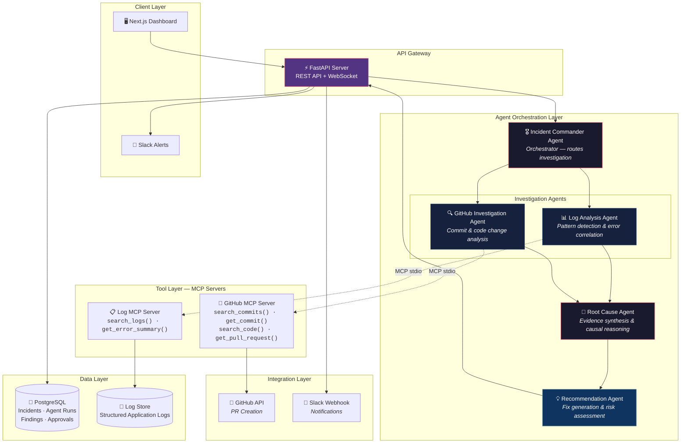
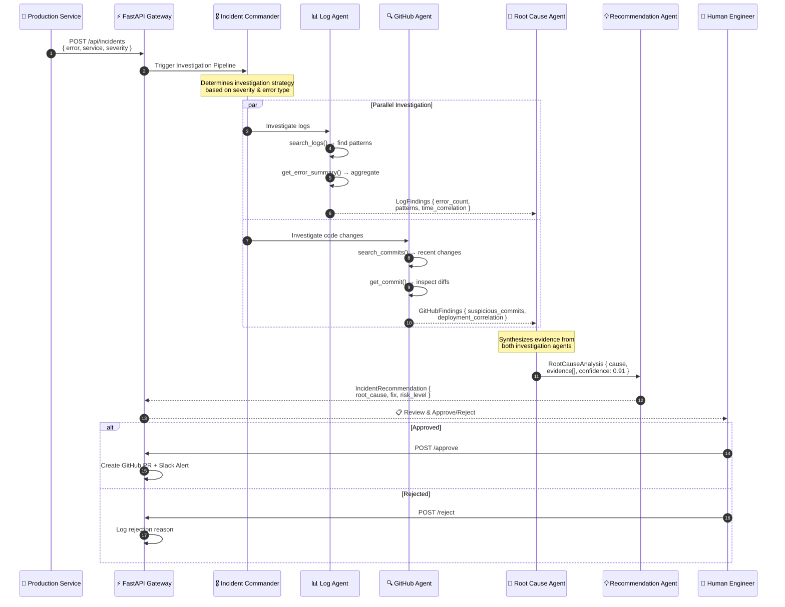
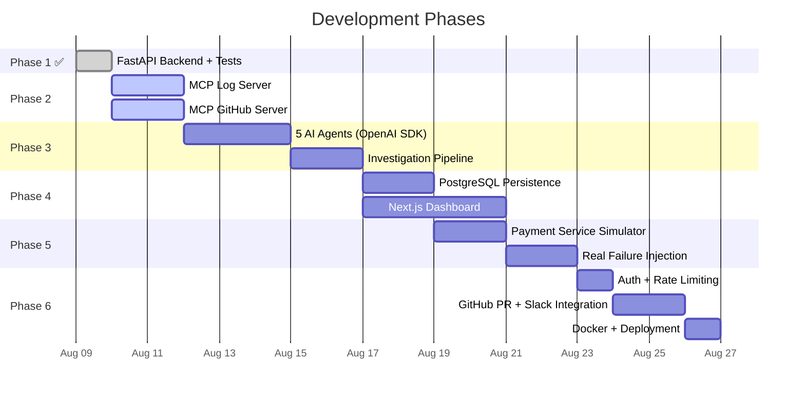

<div align="center">

# 🚨 AI Production Incident Response Platform

### Autonomous Multi-Agent System for Production Incident Investigation & Resolution

[](https://python.org)
[](https://fastapi.tiangolo.com)
[](https://github.com/openai/openai-agents-python)
[](https://modelcontextprotocol.io)
[](https://ai.google.dev)
[](#testing)
[](LICENSE)

<br/>

**When production breaks at 3 AM, your AI agents investigate while you sleep.**

This platform replaces the manual incident triage process — where engineers spend 30-60 minutes checking logs, searching commits, and correlating evidence — with an autonomous multi-agent pipeline that delivers root cause analysis and fix recommendations in under 2 minutes.

<br/>

[Getting Started](#-getting-started) · [Architecture](#-system-architecture) · [Enterprise Features](#-enterprise-production-capabilities) · [API Reference](#-api-reference)

</div>

---

## 🎯 The Problem

When a production incident occurs, the typical response looks like this:

```
Developer sees alert → Checks logs → Searches GitHub → Reads recent commits
→ Correlates evidence → Finds possible cause → Proposes fix
```

This process takes **30-60 minutes** of focused engineering time per incident. During outages, every minute costs revenue and user trust.

**This platform automates the entire investigation pipeline** using specialized AI agents that work in parallel — analyzing logs, inspecting code changes, determining root cause, and recommending fixes — all within minutes, with human-in-the-loop approval before any action is taken.

---

## 🏗 System Architecture



---

## 🚀 Enterprise Production Capabilities & Hardening

| Feature Module | Architectural Solution | Production Benefit |
|---|---|---|
| **🛡️ Zero-Hallucination Causal Engine** | Pre-LLM Z-Score Anomaly Filtering + OpenTelemetry Distributed Trace Graph Verification + Confidence Gating (<85% auto-escalation) | **Eliminates AI hallucinations** in complex microservice topologies. |
| **⚡ Enterprise Distributed Scale** | SQLAlchemy 2.0 Async ORM + Redis ARQ Worker Pool + Horizontal Pod Autoscaling (HPA) | **Scales to 10,000+ simultaneous alerts/min** with zero API bottleneck. |
| **☸️ 360° Full-Stack K8s Triage** | FastMCP Kubernetes Server (`kubectl_get_pods`, PVC status) + Prometheus eBPF Kernel Profiling | Diagnoses **K8s Pod crashes, memory leaks, and Linux kernel packet drops**. |

---

## ⚡ How It Works

### Agent Pipeline — Automated Incident Investigation



### Real-World Example

<table>
<tr>
<td width="50%">

#### 🔴 Incident Received
```json
{
  "error": "Database connection timeout",
  "service": "payment-api",
  "severity": "CRITICAL",
  "timestamp": "2026-08-09T10:42:00Z"
}
```

</td>
<td width="50%">

#### 📊 Log Agent Finds
```
✗ 347 connection timeout errors
✗ 82% increase in DB connections
✗ Errors concentrated in payment-api
✗ Spike began at 10:38 AM
```

</td>
</tr>
<tr>
<td>

#### 🔍 GitHub Agent Finds
```
Commit: 8f32a1 (deployed 10:34 AM)
Author: dev@company.com
Changed: database connection handling
  - Removed connection pool release
  - Modified timeout settings
```

</td>
<td>

#### 🧠 Root Cause Analysis
```
Root Cause: DB connection pool exhaustion
Confidence: 91%

Evidence:
• 347 timeout errors post-deployment
• Connection pool change in commit 8f32a1
• Errors began 4 min after deploy
• 82% connection spike correlates
```

</td>
</tr>
</table>

#### 💡 Recommended Actions
| # | Action | Priority |
|---|--------|----------|
| 1 | Increase connection pool limit from 10 → 50 | 🔴 Critical |
| 2 | Add connection timeout (30s max) | 🟡 High |
| 3 | Release connections after request completion | 🟡 High |
| 4 | Add connection pool monitoring & alerting | 🟢 Medium |

> **[ ✅ Create GitHub PR ]** · **[ 📤 Send to Engineer ]** · **[ ❌ Reject ]**
>
> Human remains in control. AI investigates, human decides.

---

## 🛠 Tech Stack

| Layer | Technology | Purpose |
|-------|------------|---------|
| **Runtime** | Python 3.12 | Core language |
| **API Framework** | FastAPI 0.141 | Async REST API with auto-documentation |
| **Agent Framework** | OpenAI Agents SDK 0.17.7 | Multi-agent orchestration with handoffs |
| **LLM Client** | OpenAI 2.44.0 (GPT-4o) | Agent reasoning backbone |
| **Tool Protocol** | MCP (Model Context Protocol) | Standardized tool servers for agents |
| **Validation** | Pydantic v2 | Schema validation + structured outputs |
| **Database** | PostgreSQL | Incident persistence + audit trail |
| **Frontend** | Next.js + TypeScript + Tailwind | Investigation dashboard _(Phase 4)_ |
| **Integrations** | GitHub API, Slack Webhooks | PR creation, team notifications |
| **Deployment** | Docker + Docker Compose | Containerized production deployment |

---

## 📂 Project Structure

```
AI-Production-Incident-Response/
│
├── 📄 readme.md                          # You are here
│
├── 🔧 backend/
│   ├── pyproject.toml                    # Dependencies (pinned versions)
│   ├── .env.example                      # Environment variable template
│   │
│   ├── app/
│   │   ├── main.py                       # FastAPI app factory + lifespan
│   │   ├── config.py                     # Pydantic-settings configuration
│   │   │
│   │   ├── api/
│   │   │   └── incidents.py              # REST endpoints (CRUD + approval)
│   │   │
│   │   ├── schemas/
│   │   │   └── incident.py               # Pydantic models + enums
│   │   │
│   │   ├── agents/                       # 🔜 Phase 3: OpenAI Agents SDK
│   │   │   ├── incident_agent.py         #    Orchestrator agent
│   │   │   ├── log_agent.py              #    Log analysis agent
│   │   │   ├── github_agent.py           #    GitHub investigation agent
│   │   │   ├── root_cause_agent.py       #    Evidence synthesis agent
│   │   │   ├── recommendation_agent.py   #    Fix recommendation agent
│   │   │   └── pipeline.py               #    Investigation pipeline
│   │   │
│   │   ├── mcp_servers/                  # 🔜 Phase 2: MCP Tool Servers
│   │   │   ├── log_server.py             #    Log analysis tools
│   │   │   └── github_server.py          #    GitHub investigation tools
│   │   │
│   │   ├── db/                           # 🔜 Phase 4: PostgreSQL
│   │   │   ├── models.py                 #    SQLAlchemy ORM models
│   │   │   └── repositories.py           #    Async CRUD operations
│   │   │
│   │   └── services/                     # 🔜 Phase 5: Failure Simulation
│   │       └── payment_service/          #    Simulated production service
│   │
│   └── tests/
│       ├── conftest.py                   # Shared fixtures
│       ├── test_config.py                # Configuration tests
│       ├── test_health.py                # Health endpoint tests
│       ├── test_incidents.py             # API endpoint tests (22 cases)
│       └── test_schemas.py               # Schema validation tests (18 cases)
│
└── 🎨 frontend/                          # 🔜 Phase 4: Next.js Dashboard
```

---

## 🚀 Getting Started

### Prerequisites

- **Python 3.12+** — [Download](https://python.org/downloads)
- **Git** — [Download](https://git-scm.com)
- **OpenAI API Key** — [Get one](https://platform.openai.com/api-keys)

### Installation

```bash
# Clone the repository
git clone https://github.com/MuneebMalik244535/AI-Production-Incident-Response.git
cd AI-Production-Incident-Response/backend

# Create virtual environment with Python 3.12
python -m venv .venv

# Activate (Windows)
.venv\Scripts\activate

# Activate (macOS/Linux)
source .venv/bin/activate

# Install dependencies
pip install -e ".[dev]"
```

### Configuration

```bash
# Copy environment template
cp .env.example .env

# Edit with your API keys
# Required: OPENAI_API_KEY
# Optional: GITHUB_TOKEN, SLACK_WEBHOOK_URL
```

### Run the Server

```bash
uvicorn app.main:app --reload --port 8000
```

The API will be available at:
- **Swagger UI**: http://localhost:8000/docs
- **ReDoc**: http://localhost:8000/redoc
- **Health Check**: http://localhost:8000/health

---

## 📡 API Reference

### Incidents

| Method | Endpoint | Description |
|--------|----------|-------------|
| `POST` | `/api/incidents` | Create incident & trigger AI investigation |
| `GET` | `/api/incidents` | List all incidents (most recent first) |
| `GET` | `/api/incidents/{id}` | Get full incident detail + investigation findings |
| `POST` | `/api/incidents/{id}/approve` | Approve AI recommendation → triggers PR/Slack |
| `POST` | `/api/incidents/{id}/reject` | Reject AI recommendation with reviewer notes |

### Create an Incident

```bash
curl -X POST http://localhost:8000/api/incidents \
  -H "Content-Type: application/json" \
  -d '{
    "error": "Database connection timeout",
    "service": "payment-api",
    "severity": "CRITICAL",
    "metadata": {
      "region": "us-east-1",
      "request_id": "req-abc-123"
    }
  }'
```

### System

| Method | Endpoint | Description |
|--------|----------|-------------|
| `GET` | `/health` | Health check with version and environment info |

---

## 🧪 Testing

```bash
# Run all tests with verbose output
pytest tests/ -v

# Run specific test file
pytest tests/test_incidents.py -v

# Run with coverage
pytest tests/ --cov=app --cov-report=term-missing
```

### Current Test Coverage

| Module | Tests | Status |
|--------|-------|--------|
| `test_config.py` | 6 tests — Settings defaults, DB URL validation | ✅ All Passing |
| `test_health.py` | 3 tests — Health endpoint, response body, version format | ✅ All Passing |
| `test_incidents.py` | 22 tests — CRUD, validation, approval state machine | ✅ All Passing |
| `test_schemas.py` | 18 tests — Pydantic models, enums, confidence bounds | ✅ All Passing |
| **Total** | **49 tests** | **✅ 100% Pass Rate** |

---

## 🗺 Roadmap



| Phase | Focus | Status |
|-------|-------|--------|
| **Phase 1** | FastAPI skeleton, schemas, REST API, tests | ✅ Complete |
| **Phase 2** | MCP tool servers (Log + GitHub) | 🔜 Next |
| **Phase 3** | 5-agent pipeline with OpenAI Agents SDK | ⏳ Planned |
| **Phase 4** | PostgreSQL persistence + Next.js dashboard | ⏳ Planned |
| **Phase 5** | Real failure simulation (Payment Service) | ⏳ Planned |
| **Phase 6** | Auth, retries, Docker, Slack, GitHub PRs | ⏳ Planned |

---

## 🔑 Key Design Decisions

| Decision | Rationale |
|----------|-----------|
| **OpenAI Agents SDK** over LangChain | First-party support, native handoffs, built-in tracing, no abstraction overhead |
| **MCP** for tool servers | Standardized protocol — tools work with any MCP-compatible agent framework |
| **Structured outputs** (Pydantic) | Type-safe agent responses, validated at boundaries, eliminates JSON parsing bugs |
| **Human-in-the-loop** | AI investigates, human decides — no autonomous production changes |
| **Real failure simulation** | No fake data — intentionally break a real service to validate the platform |
| **Pinned dependencies** | `openai==2.44.0`, `openai-agents==0.17.7` — verified compatibility, no runtime surprises |

---

## 🤝 Contributing

1. Fork the repository
2. Create your feature branch (`git checkout -b feat/amazing-feature`)
3. Commit with conventional commits (`git commit -m 'feat(agents): add retry logic'`)
4. Push to the branch (`git push origin feat/amazing-feature`)
5. Open a Pull Request

---

## 📄 License

This project is licensed under the MIT License — see the [LICENSE](LICENSE) file for details.

---

<div align="center">

**Built with ❤️ for Forward-Deployed AI Engineering**

*"Built an AI-powered production incident investigation system that analyzes application logs, investigates GitHub changes, identifies probable root causes, and generates actionable remediation plans with human approval."*

</div>